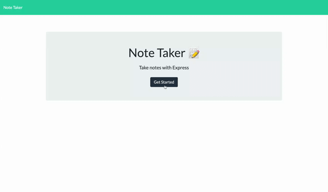

# Express Note Taker

## Table of content
- [Description](#description)
- [Installation](#installation)
- [Contribute](#contribute)
- [Questions](#question)
- [Demo](#demo)
    
## Description
This is an express.js app that is deployed to both GitHub and Heroku

### Deployed link
<https://afternoon-castle-95204.herokuapp.com/>

    
## Installation
To install the files needed to run the app, run the following command:
~~~
npm i
~~~

## Contribute
If you would like to contribute, please checkout <http://www.github.com/monacoglynn>
    
## Questions
For any questions, please email me at <pmtgcode@gmail.com>

## Demo

